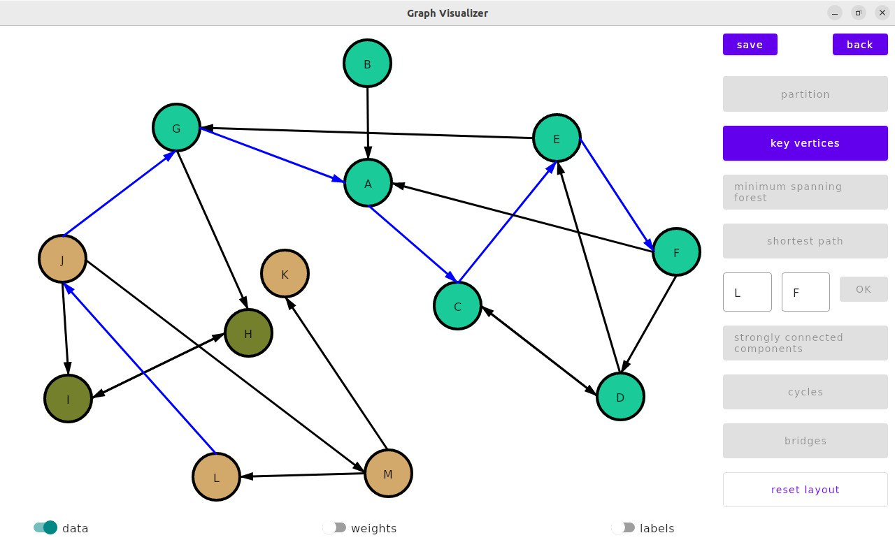

# Graph visualization and analysis app
This app enables users to visualize and analyze graphs using gui.
Application supports modern (later 2006) and classic graph algorithms, allowing for analysis and visualization.



## Features
- Supported graphs: 
  - weighted or unweighted 
  - directed or undirected
- Saving and reading with SQLite, neo4j or in .svs file
- [High closeness centrality vertices](https://www.researchgate.net/publication/281414046_An_Extremely_Fast_Algorithm_for_Identifying_High_Closeness_Centrality_Vertices_in_Large-Scale_Networks)
- [Detecting communities](https://en.wikipedia.org/wiki/Louvain_method)
- [Layout](https://www.researchgate.net/publication/262977655_ForceAtlas2_a_Continuous_Graph_Layout_Algorithm_for_Handy_Network_Visualization_Designed_for_the_Gephi_Software)
- Сlassic algorithms (SCC, SSSP, finding cycles, etc.)

## Getting started

```bash
git clone git@github.com:spbu-coding-2023/graphs-team-9.git

cd graphs-team-9

./gradlew run
```

## Resources

**Articles with general algorithms:**
1. Jacomy, Mathieu and Venturini, Tommaso and Heymann, Sebastien and Bastian, Mathieu (2014). ForceAtlas2, a Continuous Graph Layout Algorithm for Handy Network Visualization Designed for the Gephi Software. [10.1371/journal.pone.0098679](https://www.researchgate.net/publication/262977655_ForceAtlas2_a_Continuous_Graph_Layout_Algorithm_for_Handy_Network_Visualization_Designed_for_the_Gephi_Software)
2. Blondel, Vincent D; Guillaume, Jean-Loup; Lambiotte, Renaud; Lefebvre, Etienne (2008). "Fast unfolding of communities in large networks". Journal of Statistical Mechanics: Theory and Experiment. [10.1088/1742-5468/2008/10/P10008](https://iopscience.iop.org/article/10.1088/1742-5468/2008/10/P10008)
3. Ufimtsev, Vladimir and Bhowmick, Sanjukta (2014). An Extremely Fast Algorithm for Identifying High Closeness Centrality Vertices in Large-Scale Networks. [Link](https://www.researchgate.net/publication/281414046_An_Extremely_Fast_Algorithm_for_Identifying_High_Closeness_Centrality_Vertices_in_Large-Scale_Networks)


**Implementations:**
1. [forceatlas2](https://github.com/bhargavchippada/forceatlas2/tree/master), GPL-3.0 license
2. [louvain](https://github.com/JetBrains-Research/louvain/tree/main), Apache-2.0 license

## License

This project uses the GNU General Public License v3.0. See the [LICENSE](LICENSE) for more info.
